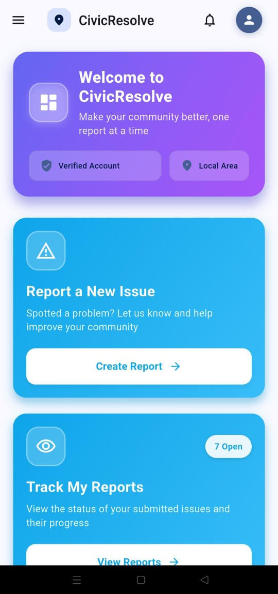
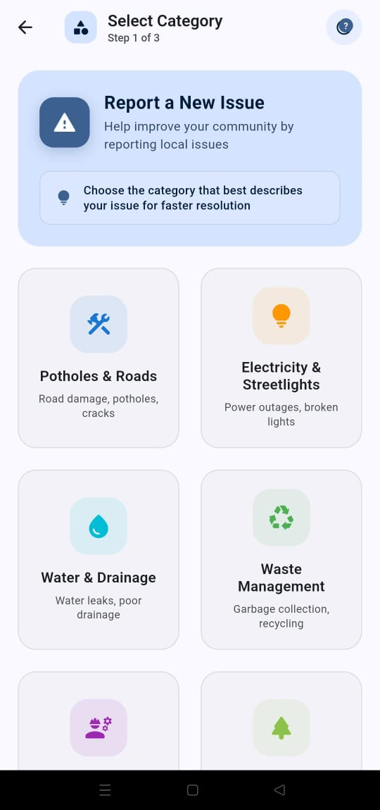
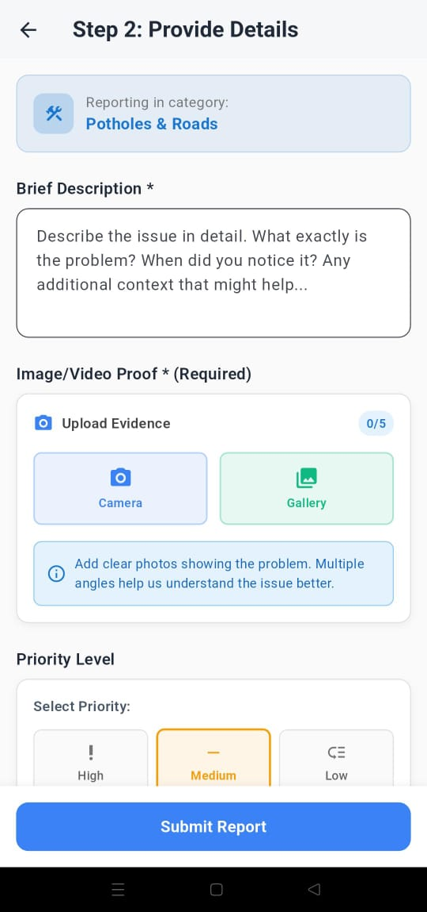
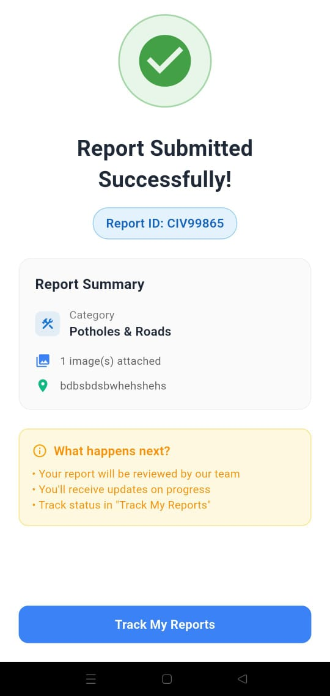
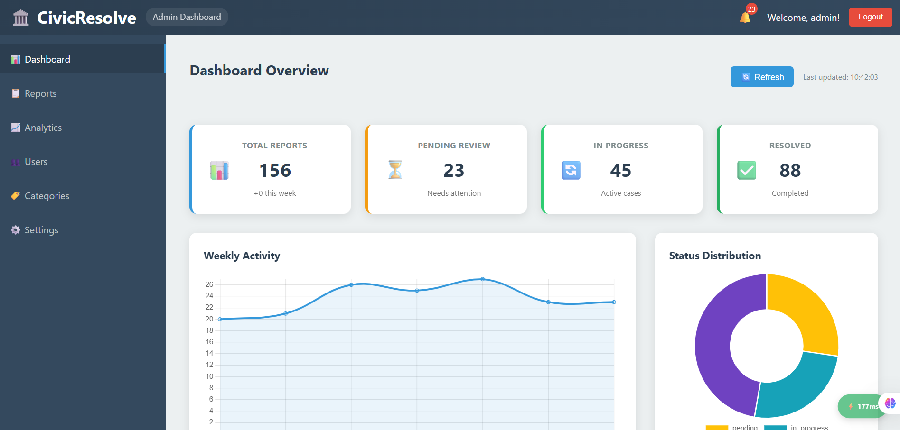

<div align="center">

# 🚀 BARRE CHORDS
### Crowdsourcing Civic Issue Reporting & Resolution System

[](https://www.sih.gov.in/)
[](https://www.sih.gov.in/)
[](https://www.sih.gov.in/)
[](#)

<br />
<a href="https://barre.pages.dev/">
  
</a>
<a href="https://youtu.be/RZbovuI7gFg">
  
</a>
<a href="https://docs.google.com/spreadsheets/d/1dCCleNU2lp0RIOz0-KM4JaEw3maJnhjTvF5sVgw2CgE/edit?usp=drivesdk">
  
</a>

<br /><br />

**Problem Statement ID:** 25031 | **Team:** Barre Chords | **Domain:** Smart Automation

</div>

---

## 💡 The Problem & Solution
**60% of civic issues go unreported** simply because the process is too hard, and **75% of citizens** are unsure which department to contact.

**Barre Chords** solves this by creating a unified ecosystem where **Citizens**, **Municipal Staff**, and **Contractors** work together. We use **Gemini AI** to automatically sort complaints and **Gamification** (Tokens = Free Plants) to encourage people to keep their city clean.

### 🔄 How It Works (The Workflow)

| **Step 1: SNAP 📸** | **Step 2: AI SORT 🤖** | **Step 3: RESOLVE 🚜** | **Step 4: REWARD 🌱** |
| :--- | :--- | :--- | :--- |
| **Citizen** takes a photo of a pothole or garbage. GPS is auto-tagged. | **Gemini AI** analyzes the image, assigns priority (High/Med/Low), and routes it to the right department. | **Contractors** bid on the job via the app. Municipal staff approve and track progress. | **Citizen** gets notified of the fix and earns tokens redeemable for free plants. |

---
## 📸 Application Previews

### 📱 Mobile App (Citizen & Contractor)
<table align="center">
  <tr>
    <td align="center">
      
      <br />
      <b>Dashboard</b>
    </td>
    <td align="center">
      
      <br />
      <b>Issue Reporting</b>
    </td>
    <td align="center">
      
      <br />
      <b>Brief Report</b>
    </td>
    <td align="center">
      
      <br />
      <b>Report Confirmation </b>
    </td>
  </tr>
</table>

### 💻 Municipal Dashboard (Web)
<div align="center">
  
  <p><i>Real-time report view and ticket management for municipal staff.</i></p>
</div>

---

## 📱 The Ecosystem: 3-Pillar Approach

Our platform connects three distinct user groups to ensure efficiency and accountability.

### 1. 👥 For Citizens (Reporting & Rewards)
* **📸 Easy Reporting:** Effortless issue submission with photo capture, precise GPS location tagging, and quick descriptions.
* **📍 Transparent Tracking:** Real-time updates (Reported → Assigned → Resolved) so users know their voice is heard.
* **🌱 Civic Rewards (Green Initiative):** Users earn tokens for reporting issues. These tokens are redeemable for **free plants** from government nurseries, fostering environmental impact.

### 2. 🏛️ For Municipal Departments (AI Automation)
* **🤖 AI Dept Allocation:** Uses **Gemini API** to detect issue types (e.g., Sanitation, Public Works) and auto-routes them, removing manual sorting.
* **🔥 Priority Tagging:** Reports are instantly tagged as **High, Medium, or Low** priority based on urgency.
* **📊 Data-Driven Governance:** A centralized dashboard to monitor open tickets and optimize resource allocation.

### 3. 👷 For Contractors (Economic Growth)
* **💼 Opportunity Portal:** Access a curated list of government-approved civic projects requiring rapid resolution.
* **⚡ Streamlined Bidding:** A transparent, efficient process allowing contractors to bid on and get assigned jobs quickly.
* **💰 Economic Empowerment:** Creates a new revenue stream for local businesses and supports the local economy.

---

## ⚡ Tech Stack & Architecture

We built a scalable, cloud-native solution designed for high availability.

| Component | Tech | Purpose |
| :--- | :--- | :--- |
| **📱 App** |  | Cross-platform mobile app for Citizens & Contractors. |
| **💻 Web** |  | Admin Dashboard for Municipal Authorities. |
| **🧠 AI** |  | Intelligent routing & priority analysis. |
| **🗄️ Backend** |  | PostgreSQL Database & Auth. |
| **☁️ Deploy** |  | High-speed content delivery. |

---

## 💰 Business Viability & Market Size

We have analyzed the market potential and sustainability of this solution.

### 📊 Market Analysis (India)
* **₹140 Cr** - **TAM (Total Addressable Market):** The entire Smart City technology sector.
* **₹96.91 Cr** - **SAM (Serviceable Available Market):** Urban civic tech solutions.
* **₹13.39 Cr** - **SOM (Serviceable Obtainable Market):** Our realistic initial market capture.

### 💸 Revenue Model
1.  **Government Subscription:** Tiered monthly fees for municipal access to the AI Dashboard and Analytics.
2.  **Contractor Service Fees:** A small commission on each job facilitated or awarded through the platform.

### 📉 Cost Structure
* **Fixed:** Platform development, AI model training.
* **Variable:** Cloud hosting (pay-as-you-go), Marketing & Partnerships.

---
## 📈 Why This Matters (Research Data)
Based on our primary research survey of **2300+ data points** and analysis from global reports:

> 📂 **[View Full Survey Data Spreadsheet](https://docs.google.com/spreadsheets/d/1dCCleNU2lp0RIOz0-KM4JaEw3maJnhjTvF5sVgw2CgE/edit?usp=drivesdk)**

* 🔴 **92%** of respondents prefer reporting issues via a mobile app over visiting an office.
* 🔴 **65%** are dissatisfied with the speed and feedback of current grievance redressal systems.
* 🔴 **85%** want real-time status updates on their complaints.
* 🔴 **60%** of civic issues currently go unreported due to complex procedures.
* 🟢 **Impact:** By automating these reports, we directly improve community safety and cleanliness.

**📚 References & Data Sources:**
*Primary Survey, Praja.org, pafindia.org, prsindia.org, Deloitte, Statista, IJCRT.org, and McKinsey.*

> *"Empowering citizens to hold government accountable through transparency."*
---

## 🌟 Key Impacts

| **Social** | **Environmental** | **Economic** |
| :--- | :--- | :--- |
| Rebuilds trust through transparency and accountability. | Promotes a greener city via the "Plants for Tokens" reward system. | Supports local contractors by connecting them to government projects. |

---

## 📂 Repository Structure

```bash
├── 📱 application/         # Mobile Application (Dart/Flutter)
├── 🌐 website/             # Admin Dashboard (HTML/JS)
├── 📄 docs/                # Research Data & SIH Presentation
└── 📝 README.md            # You are here!

```
---

## 📺 See It In Action

<div align="center">
  <a href="https://www.youtube.com/embed/RZbovuI7gFg?si=RxaPz6uDyhgm6j30">
    
  </a>
  <p><i>👆 Click to watch the full project demonstration</i></p>
</div>


<div align="center"> <p><b>Developed with 💚 by Team Barre Chords</b></p> <p><i>Smart India Hackathon 2025</i></p> </div>
